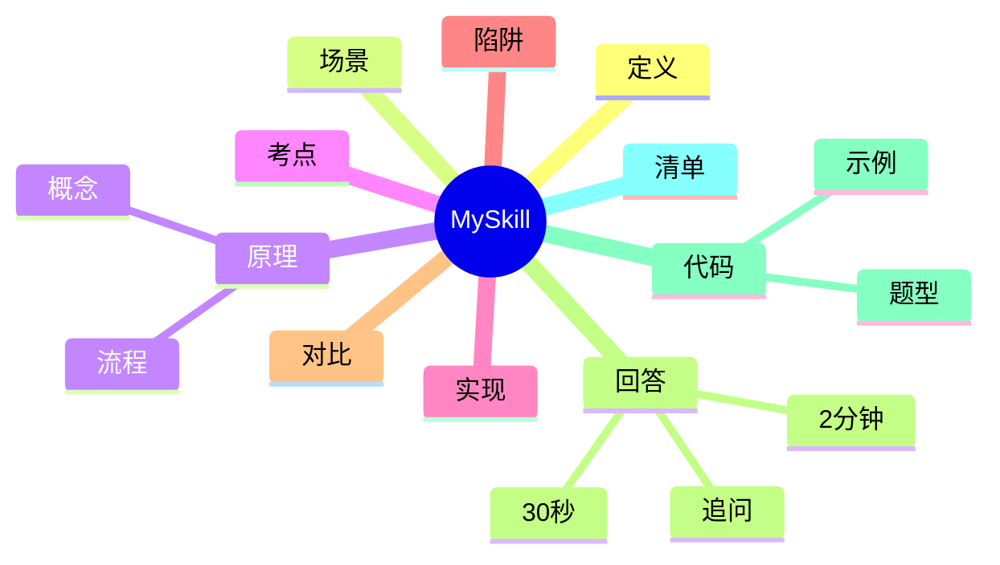

---
title: "MySkill"
aliases: ["MySkill 八股", "MySkill 面试"]
tags: [Java, 八股, Interview/高频, 技能, 工具]
created: 2026-01-21
level: interview
status: draft
---

# MySkill

> [!summary] TL;DR（3-5 行）
> - 一句话定义：MySkill 是用于描述与规范某类技能的笔记模板。
> - 面试一句话结论：好的技能笔记强调输入/输出与可复用流程。
> - 关键点：用途边界、流程步骤、输入输出示例、常见陷阱。
> - 常见坑：只有概念没有流程、缺少示例、不可复用。

> [!tip]
> **工程师思维自检**：
> 1. 我能用这篇笔记直接执行某项技能吗？
> 2. 这篇笔记能被复用到不同场景吗？

---

## 1. 定义与定位

- **它是什么**：一个技能说明笔记，用于标准化“做一件事”的方法。
- **解决什么问题**：避免“只知道概念不会做”，强调流程与示例。
- **体系中的位置**：工具类知识，连接 [[技能模板]] 与 [[工作流]]。

---

## 2. 应用场景

- 场景 1：需要快速上手某项工具或流程。
- 场景 2：团队内共享标准化操作方式。
- 不适用：只有灵感记录、无操作步骤的随笔。

---

## 3. 核心原理（面试够用版）

> [!note] 先给结论，再解释“怎么做到”

- **核心机制**（5-7 条要点）：
  1) 明确技能目标与边界。
  2) 写出可执行步骤（从输入到输出）。
  3) 给出最小可用示例。
  4) 标出常见失败点与排查思路。
  5) 与相关技能建立链接。

### 3.1 关键流程（步骤）

1. 定义目标 → 2. 列步骤 → 3. 给示例 → 4. 复用与优化。

### 3.2 关键概念

- **输入/输出**：技能能否复用的关键。
- **可执行性**：步骤必须可操作。

### 3.3 费曼类比

> [!tip] 用人话解释
> 像菜谱：不仅告诉你“这道菜是什么”，更告诉你“怎么做”。

---

## 4. 关键细节清单（高频考点）

- 考点 1：必须写清“输入是什么”。
- 考点 2：必须写清“输出是什么”。
- 考点 3：示例要可复现。
- 考点 4：流程要可执行，不是口号。

---

## 5. 源码/实现要点（不装行号，只抓关键）

> [!tip] 目标：回答“怎么把技能笔记落地”

- **关键组件**：标题、步骤、示例、陷阱、链接。
- **关键流程**：输入 → 操作 → 输出。
- **关键策略**：用最小示例验证流程。
- **面试话术**：技能笔记是“可操作的 SOP”。

---

## 6. 易错点与陷阱（至少 5 条）

1) 只有描述没有步骤。
2) 没有示例，无法复用。
3) 步骤太抽象，无法执行。
4) 没有标注失败点。
5) 没有与相关知识建立链接。

---

## 7. 对比与扩展（至少 2 组）

- **技能笔记 vs 概念笔记**：前者强调步骤与输出，后者强调解释。
- **模板驱动 vs 自由记录**：模板更易复用，自由记录更随意。
- 扩展问题：如何把技能笔记变成团队标准？

### 对比表

| 特性 | 技能笔记 | 概念笔记 |
| :--- | :--- | :--- |
| 目标 | 可执行 | 可理解 |
| 内容 | 步骤+示例 | 定义+原理 |
| 复用 | 高 | 中 |

---

## 8. 标准面试回答（可直接背）

### 8.1 30 秒版本（电梯回答）

> [!quote]
> MySkill 是一个技能说明笔记模板，强调输入、输出和可执行步骤。它让知识从“知道”变成“会做”，并通过示例与陷阱说明来保证复用性。

### 8.2 2 分钟版本（结构化展开）

> [!quote]
> 1) 定义与定位：技能笔记是 SOP，面向执行。 
> 2) 场景：工具使用、流程落地、团队共享。 
> 3) 原理：输入/输出清晰、步骤可执行、示例可复现。 
> 4) 易错点：缺步骤、缺示例。 
> 5) 扩展：结合链接形成知识网。

### 8.3 深挖追问（面试官继续问什么）

- 追问 1：如何验证技能笔记有效？→ 看是否能按步骤完成任务。
- 追问 2：如何提升复用性？→ 提供最小示例与边界说明。
- 追问 3：如何避免“空话式”笔记？→ 增加可执行步骤与结果。

---

## 9. 代码题与代码示例（必须有详注）

> [!important] 要求：注释解释“为什么这样写”，不是解释语法

### 9.1 面试代码题（2-3 题）

- 题 1：如何解析技能笔记的 frontmatter 并输出标签列表？
- 题 2：如何验证笔记是否包含必需模块？
- 题 3：如何自动生成模板骨架？

### 9.2 参考代码（Java）

```java
// 目标：检查一个技能笔记是否包含关键模块
// 注意：这里只做简单字符串检测，演示“可执行思路”
import java.nio.file.*;
import java.util.*;

public class SkillNoteChecker {
    public static void main(String[] args) throws Exception {
        // 1) 读取文件内容：为什么？需要验证结构是否完整
        String text = Files.readString(Paths.get("MySkill.md"));

        // 2) 定义必须模块：确保“模板驱动”
        List<String> required = Arrays.asList(
            "## 1. 定义与定位",
            "## 2. 应用场景",
            "## 3. 核心原理",
            "## 9. 代码题与代码示例"
        );

        // 3) 检查缺失项，输出结果用于复盘
        for (String section : required) {
            if (!text.contains(section)) {
                System.out.println("缺失模块: " + section);
            }
        }
    }
}
```

---

## 10. 复习 Checklist（可勾选）

- [ ] 我能清楚描述技能的目标与边界。
- [ ] 我能列出可执行步骤。
- [ ] 我能给出最小示例。
- [ ] 我能指出常见失败点。
- [ ] 我已建立相关链接。

---

## 11. Mermaid 思维导图（Obsidian 可渲染）



---

## 相关笔记（双向链接）

- [[技能模板]]
- [[工作流]]
- [[Obsidian]]
