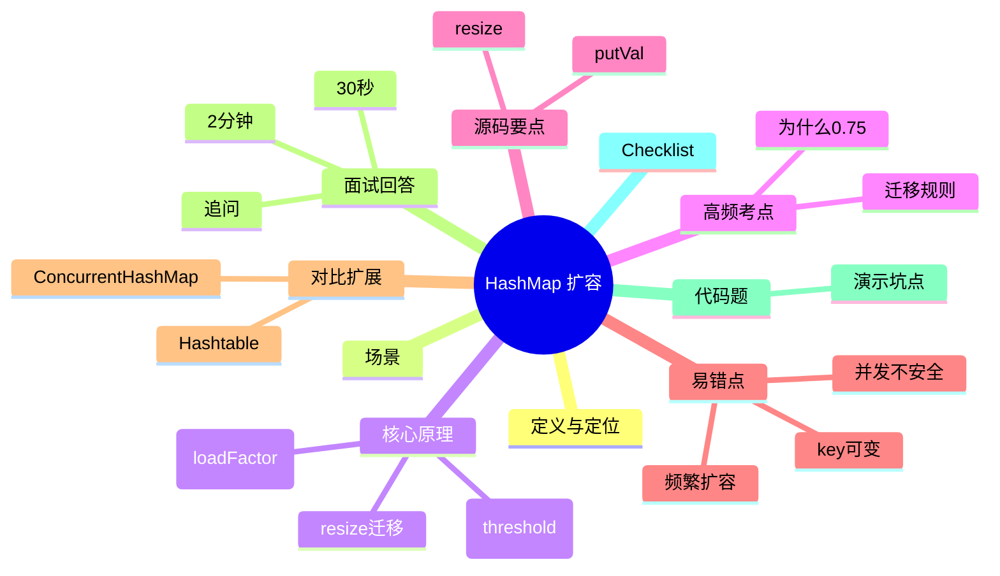

# HashMap 扩容与 rehash

> [!summary] TL;DR
> - HashMap 底层是“数组 +（链表/红黑树）”的桶结构。
> - 扩容本质：数组变大（通常翻倍）+ 节点重分布（rehash/迁移）。
> - 面试关键：阈值 threshold、负载因子 loadFactor、迁移规则（高位判定）、性能与线程安全坑。

## 1. 定义与定位
- **它是什么**：JDK 的键值对容器，追求平均 O(1) 查询/插入。
- **解决什么问题**：快速按 key 存取 value。
- **位置**：集合框架 Map 体系中的核心实现（非线程安全）。

## 2. 应用场景
- 场景：缓存映射、去重映射、索引表。
- 不适用：多线程共享写（应选 ConcurrentHashMap 或外部加锁）。

## 3. 核心原理（面试够用版）
- HashMap 用 **哈希定位桶**，桶内处理冲突：
  - 低冲突：链表
  - 冲突多：可能树化（红黑树）
- 扩容触发条件：`size > threshold`
  `threshold = capacity * loadFactor`

### 3.1 关键流程
1. put 时计算 hash → 找桶下标
2. 桶内查重/追加节点
3. size 增加后，若超过 threshold → resize
4. resize：新数组（通常 2 倍）→ 节点迁移到新桶

## 4. 关键细节清单（高频考点）
- `loadFactor` 默认 0.75：权衡空间与冲突概率
- 扩容是“昂贵操作”：迁移会带来性能抖动
- JDK8 迁移有优化：不需要重新算完整 hash，常用“高位判定”决定新位置

## 5. 源码/实现要点
- 关键流程通常在 `putVal` / `resize`（JDK8 典型实现）
- 迁移规则（面试说法）：
  - 扩容后桶下标要么不变，要么变为 `oldIndex + oldCap`（取决于 hash 的某一位）

## 6. 易错点与陷阱（至少 5 条）
1) 认为 HashMap 线程安全（错）
2) 频繁扩容导致抖动（应预估容量）
3) key 可变导致 hash 变化（查不到）
4) 冲突严重导致退化（链表长）
5) 误把 loadFactor 设太小造成浪费

## 7. 对比与扩展
- HashMap vs Hashtable：线程安全、性能、null 支持
- HashMap vs ConcurrentHashMap：并发控制策略不同
- 扩展：为什么 JDK8 在并发下不会像 JDK7 那样“链表环”但仍不安全？

## 8. 标准面试回答（可直接背）
### 8.1 30 秒版本
> [!quote]
> HashMap 底层是数组加链表/红黑树的桶结构。扩容在 size 超过阈值 threshold 时触发，threshold=capacity*loadFactor。扩容会创建更大的数组并把旧节点迁移到新桶，JDK8 迁移常用高位判定决定位置要么不变要么 oldIndex+oldCap。扩容很耗时且 HashMap 非线程安全，多线程写会出问题。

### 8.2 2 分钟版本
> [!quote]
> 1) 定义：HashMap 是 Map 的常用实现，平均 O(1) 存取。
> 2) 场景：缓存映射/索引表，但不适合并发写。
> 3) 原理：哈希定位桶，冲突用链表，冲突多可树化；size 超过 threshold 触发 resize。
> 4) 迁移：新数组通常翻倍，JDK8 用高位判定决定迁移到原位或原位+oldCap，减少重算。
> 5) 坑：扩容抖动、key 可变、并发不安全，预估容量或用并发 Map。

### 8.3 深挖追问
- 为什么 0.75 常用？→ 空间 vs 冲突概率的折中
- 为什么迁移只看某一位？→ 容量翻倍等价于桶下标多一位参与运算
- HashMap 并发会怎样？→ 丢数据/覆盖/结构不一致（本质无同步）

## 9. 代码题与代码示例（必须有详注）
### 9.1 面试代码题
- 题 1：如何估算 HashMap 初始容量避免扩容？
- 题 2：演示 key 可变导致 get 失败
- 题 3：如何在并发下安全使用 Map？

### 9.2 参考代码（Java）
```java
import java.util.HashMap;
import java.util.Map;

public class HashMapPitfallsDemo {

    // 演示 1：key 可变会导致“放得进去，取不出来”
    // 原因：HashMap 依赖 key 的 hashCode/equals 来定位桶和比较；
    // 如果 key 的参与 hash 的字段变了，hashCode 变了 -> 桶位置就变了。
    static class MutableKey {
        int id; // 参与 hash 的字段（模拟“可变 key”）

        MutableKey(int id) { this.id = id; }

        @Override public int hashCode() {
            // hashCode 依赖 id；一旦 id 变了，hashCode 就变了
            return Integer.hashCode(id);
        }

        @Override public boolean equals(Object o) {
            if (!(o instanceof MutableKey)) return false;
            return this.id == ((MutableKey) o).id;
        }

        @Override public String toString() { return "Key(" + id + ")"; }
    }

    public static void main(String[] args) {
        Map<MutableKey, String> map = new HashMap<>();

        MutableKey k = new MutableKey(1);
        map.put(k, "value");

        // 这时能取到
        System.out.println("Before change: " + map.get(k)); // value

        // 修改 key 内部状态（大坑！）
        k.id = 2;

        // 现在：get 会根据新的 hashCode 去找桶 -> 找不到
        System.out.println("After change: " + map.get(k));  // null

        // 面试总结：HashMap 的 key 必须“不可变”（或至少参与 hash 的字段不可变）
    }
}
```

## 10. 复习 Checklist

* [ ] 我能说明 threshold = capacity * loadFactor
* [ ] 我能解释扩容迁移的大致规则
* [ ] 我能讲 5 个常见坑
* [ ] 我能说清 HashMap 并发不安全原因
* [ ] 我能写出 key 可变导致失败的例子

## 11. Mermaid 思维导图



## 参考与建议（固定三站点）

* JavaGuide：…
* PDai：…
* 官方源码导读：…
