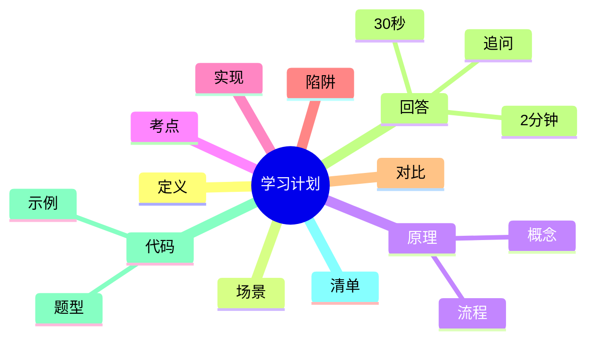

---
title: "八股学习计划"
aliases: ["八股学习计划 八股", "八股学习计划 面试"]
tags: [Java, 八股, Interview/高频, 学习计划, 复习]
created: 2026-01-21
level: interview
status: draft
---

# 八股学习计划

> [!summary] TL;DR（3-5 行）
> - 一句话定义：面试导向的知识复习与训练计划，按时间拆解目标。
> - 面试一句话结论：计划要“可量化+可复盘”，每天有输入/输出/演练。
> - 关键点：分阶段拆解、每天写代码、定期模拟面试、复盘纠偏。
> - 常见坑：只看不练、目标过大、没有反馈机制。

> [!tip]
> **工程师思维自检**：
> 1. 我能用计划驱动“可验证产出”吗？
> 2. 计划里有明确的“检验点”与“纠偏机制”吗？

---

## 1. 定义与定位

- **它是什么**：以面试为目标的知识点复习+练习计划，强调阶段性产出。
- **解决什么问题**：把“要学很多”拆成可执行的每日任务。
- **体系中的位置**：面试准备的作战地图，连接 [[Java 基础]]、[[JVM]]、[[并发]] 等模块。

---

## 2. 应用场景

- 场景 1：1-2 个月内集中冲刺校招/社招面试。
- 场景 2：项目经验薄弱，需系统补齐知识结构。
- 不适用：完全不做练习的“纯看书式”学习。

---

## 3. 核心原理（面试够用版）

> [!note] 先给结论，再解释“怎么做到”

- **核心机制**（5-7 条要点）：
  1) 明确终局目标（能讲清核心模块）。
  2) 主题拆解成阶段与日任务。
  3) 每天有“写代码+讲出来”的输出。
  4) 定期回顾与模拟面试校准。
  5) 用错题/薄弱点驱动下一轮复习。

### 3.1 关键流程（步骤）

1. 目标拆解：基础 → 并发/JVM → 框架/数据库 → 项目与场景题。
2. 每日执行：学 → 写 → 讲 → 复盘。
3. 周期复盘：按题目清单查漏补缺。

### 3.2 关键概念

- **可量化**：每天有明确产出（代码/笔记/讲解录音）。
- **可复盘**：每周回看“薄弱点清单”。

### 3.3 费曼类比

> [!tip] 用人话解释
> 像健身计划：不是看教程，而是每天固定动作、每周记录数据，持续调整。

---

## 4. 关键细节清单（高频考点）

- 考点 1：**每天必须写代码**，否则输出无法验证。
- 考点 2：**要练“讲清楚”**，面试是口头表达。
- 考点 3：**分阶段复盘**，防止“学过就忘”。
- 考点 4：**题库驱动**，先以高频题为主。

---

## 5. 源码/实现要点（不装行号，只抓关键）

> [!tip] 目标：回答“执行层面为什么这样做”

- **关键模块**：基础/并发/JVM/框架/DB/Redis/场景题。
- **关键流程**：输入（学习）→ 输出（笔记/代码/口述）→ 反馈（模拟面试）。
- **关键策略**：高频优先、弱点优先、持续复盘。
- **面试话术**：计划本身就是“工程化拆解与迭代”的体现。

---

## 6. 易错点与陷阱（至少 5 条）

1) 只看不练，无法形成可讲述的知识。
2) 一次性目标过大，导致执行失败。
3) 没有模拟面试，无法检验表达。
4) 不复盘，薄弱点长期存在。
5) 只刷题不理解原理，问深挖会暴露。

---

## 7. 对比与扩展（至少 2 组）

- **面试冲刺 vs 长期积累**：冲刺重高频覆盖，积累重体系深度。
- **输入驱动 vs 输出驱动**：输出驱动更能暴露短板。
- 扩展问题：如何把项目经验融入计划中？

### 对比表

| 特性 | 面试冲刺 | 长期积累 |
| :--- | :--- | :--- |
| 时间 | 1-2 个月 | 6 个月以上 |
| 目标 | 高频覆盖 | 体系深度 |
| 手段 | 题库+模拟 | 书籍+项目 |

---

## 8. 标准面试回答（可直接背）

### 8.1 30 秒版本（电梯回答）

> [!quote]
> 八股学习计划就是把面试高频知识按阶段拆解成每天可执行的任务，并要求每天有代码与讲解输出。核心是量化目标、持续复盘和模拟面试，保证学过的内容能讲出来、能写出来。

### 8.2 2 分钟版本（结构化展开）

> [!quote]
> 1) 定义与定位：面试导向的学习/训练计划，强调输出与复盘。 
> 2) 场景：短期冲刺或补齐基础。 
> 3) 原理：拆解阶段、每日输出、每周复盘与模拟面试。 
> 4) 易错点：只看不练、没有反馈。 
> 5) 扩展：结合项目经验，增强场景题表达。

### 8.3 深挖追问（面试官继续问什么）

- 追问 1：如何衡量“学会了”？→ 以代码产出和口述为准。
- 追问 2：如何处理薄弱点？→ 建立错题清单，下一周优先补齐。
- 追问 3：如何保证持续性？→ 固定时段+可量化目标。

---

## 9. 代码题与代码示例（必须有详注）

> [!important] 要求：注释解释“为什么这样写”，不是解释语法

### 9.1 面试代码题（2-3 题）

- 题 1：如何设计一个“每日任务清单”类，支持复盘与统计？
- 题 2：如何在 30 天计划中保证高频知识覆盖？
- 题 3：如何用数据衡量学习进度？

### 9.2 参考代码（Java）

```java
// 目标：用代码构造一个可量化的学习计划
// 注意：示例强调“可执行+可统计”，而非复杂功能
import java.util.*;

public class StudyPlanDemo {
    public static void main(String[] args) {
        // 1) 用 List 表示每天的主题，确保“可执行”
        List<String> dayTopics = Arrays.asList(
            "Java基础", "集合", "并发", "JVM", "Spring", "MySQL", "Redis"
        );

        // 2) 用 Map 记录完成情况，便于“可复盘”
        Map<String, Boolean> done = new LinkedHashMap<>();
        for (String topic : dayTopics) {
            // 为什么用 LinkedHashMap：保持顺序，复盘更直观
            done.put(topic, false);
        }

        // 3) 假设完成了部分主题，模拟进度统计
        done.put("Java基础", true);
        done.put("集合", true);

        long finished = done.values().stream().filter(v -> v).count();
        double progress = finished * 1.0 / done.size();

        // 输出进度，提醒需要“复盘”未完成项
        System.out.println("完成进度: " + (int)(progress * 100) + "%");
    }
}
```

---

## 10. 复习 Checklist（可勾选）

- [ ] 我能描述计划的阶段拆解逻辑。
- [ ] 我每天都有代码/口述输出。
- [ ] 我每周有复盘和补短板。
- [ ] 我能把项目经验融入面试表达。
- [ ] 我能用量化指标衡量进度。

---

## 11. Mermaid 思维导图（Obsidian 可渲染）



---

## 相关笔记（双向链接）

- [[Java 基础]]
- [[集合]]
- [[并发]]
- [[JVM]]
- [[Spring]]
